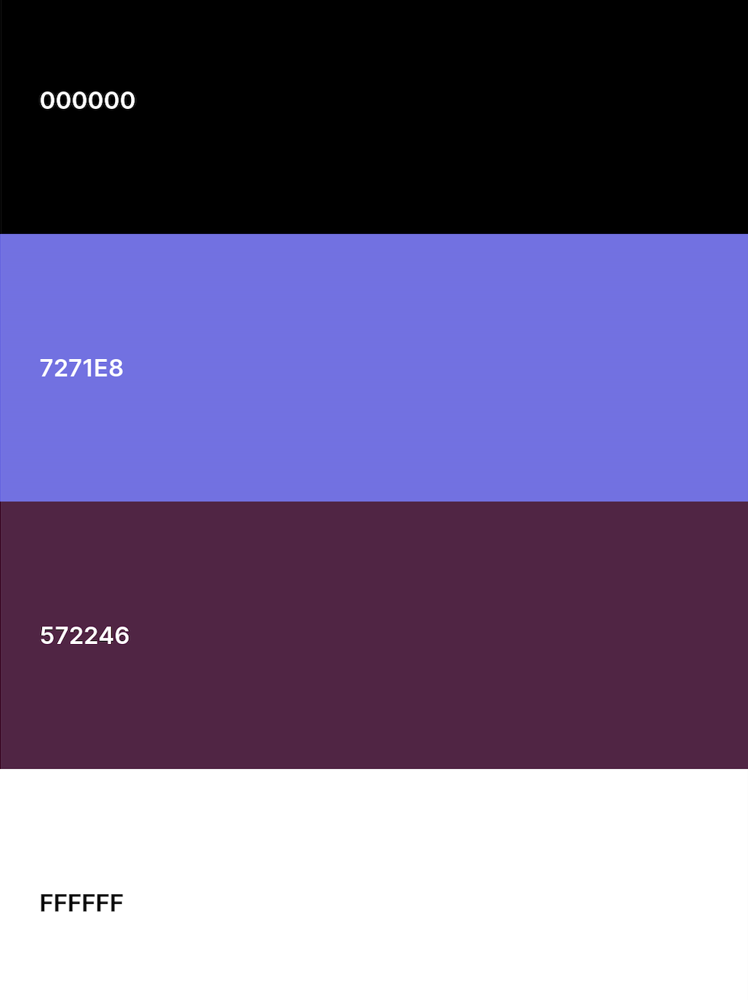

# astrohunting 
# URL to live website
[https://astrohunting.netlify.app/](https://astrohunting.netlify.app/)
# Summary
###  Community for anyone who is interested in Astrography
Learn astrophotography and take pictures of the wonders of the universe! Shoot the stars and constellations, Moon, planets, comets, nebulas, galaxies, eclipses, meteor showers and conjunctions!

You will find examples of all the different kinds of astrophotography here, tips for how to take astrophotos, and techniques for processing them to produce beautiful images.
### Context and Justification
This project aims to provide a platform where users can input there experience and technique use in creating their astrohunting sightings.
# 5 Planes of Design 
## Target audience group:
### People who are interested in astrography. 
**Age:** 18 above  

**Occupation:** Students, Working Adults anyone who want to pick up astrography as a hobby.

**IT/Photography Literacy Level:** Able to use computers with varying proficiency. Basic understanding of photography elements.

**Goals:** 
Share experiences about image created. 
The type of equipment used and how image is being process. 
Provide a knowledge sharing platform.

**Considerations:**
Consistent display of information for users and provide a search function for them to find the type of astrography that they are interested in.

## UI/UX:
### User Stories
- As someone who is keen in learning and picking up astrography as a hobby. I would like to know what are the equipment used and how experience astrographer take their images. 
Acceptance Criteria
Able to pick up some tips shared by communities

## Content & Features:

### Webpages

- ### Home 
A way to access all 3 webpages from the landing page.

- ### Browse
Collections of all posts created by community and a search function for users to streamline the information they wish to find.

- ### Create Post
A form page for anyone who wants to create a new post. By providing all the information required.

## Design

### Color Palette

The choice of color was primarily based on black which associated with the dark sky, while white represent the stars. Purple add mystery, and can even symbolise creativity for the webpage.

### Font Palette

The following choices of font were made. 

Navbar: ``font-family: 'Dreamscape'``

Body: ``font-family: 'Libre Baskerville', regular;``

### Technologies Used

## Used in all 3 sites in various ways
- HTML5
- CSS3
- JavaScript
- Bootstrap v5
- React
- MongoDB
- Axios
- Express
- Cors
- Yup

## Used in production
- Visual Studio Code
- Git
- GitHub
- Netlify
- Heroku

# Features
Features | Descriptions
-------- | -------------
Browse all post created | Showing all post created by the community in card form.
View details of post created | Users can click on the individual post and will display all the information (e.g., equipment, location, processing data etc...).
Search post | Users can search for post based on various criteria. The search will occur as the users type into the inputs or check/uncheck the checkboxes.
Add new post | Users can add a new post through the create post page.
Manage post | Users can edit/delete the post.

## Limitations and future implementations
Limitations | Future Implementations to Resolve Limitations
----------- | -------------
Anyone can edit/delete post not belonging to them | Create a user authentication where users can only edit/delete post belonging to them.
Images are "uploaded" by providing a working URL of an image and only one image can be "uploaded" for each listing. | Implement an image upload system to allow users to upload multiple image files from the web application. Then display all the images that were uploaded on the frontend web application.
Browse page gets longer when more post are being created | Implement pagination 

# TEST CASES
| #  | Test Description | Test Steps | Expected Result |
| ------------- | ------------- | ------------- | ------------- |
| 1 | In Home Page | | |
| 1.1 | Browse collection | 1) Click on the "Browse" button | Users is directed to the Browse page. User will see a search bar and multiple cards showing the details of the post |
| 1.2 | Create Post | 1) Click on the "Create Post" button | Users is navigated to Create Post page. User will see a form to add new post into the database |
| 2 | In Browse Page | | |
| 2.1 | Search for Username | 1) Type into Username textbox as emma | Result that match the keyword will be display after a few seconds |
|  | Prerequisite: Prerequisite after a search is done |  |  |
| 2.2 | Reset Search function | 1) Click on "Reset" | All input field in the search function will be cleared and Browse page will refresh to show all collections |
| 2.3 | View detailed post information | 1) Click on "More" button on any post | A modal will appear with the detailed information of the post |
|  | Prerequisite: Prerequisite Users click on more |  |  |
| 2.4.1 | Edit post information | 1) Click on "Update" button inside the modal   2) Change the desired input field   3) Click on the edit button to submit request | Redirect to the form page with all the previous information showed   Upon successful submission of fields to be edit a green alert box will show "The post has been added successfully!" |
| 2.4.2 | Delete post information | 1) Click on "Delete" button inside the modal | Go back to the Browse page the post is no longer on display |
| 3 | In Create Post Page | | |
| 3.1 | Add new post | 1) Fill up the form. All fields are required   2) Click on the "Add" button | A sucess message will be shown if new post created.   Validation error will show if inputs are not filled up correctly |
| 3.2 | Cancel new post | 1) Click on the "Cancel" button | Redirect to the Browse page |

# Deployment
Hosted on Netlify free plan, without database. All dependencies are delivered via CDN. 
To deploy, fork this code, link your Github account with netlify, and make this repo a site. 

# Dependencies
- Bootstrap v5.1
- Axios
- Animate.css
- Yup
- React-bootstrap
- React-bootstrap-icons
- React-dom
- React-on-screen

# CREDITS AND ACKNOWLEDGMENT
- Visual Studio Code
- Git
- GitHub
- Netlify
- HTML5
- CSS3
- JavaScript
- Bootstrap v5.1
- Axios
- PedroTech YouTube channel
- Content/Picture from [https://welcome.astrobin.com/](https://welcome.astrobin.com/)
